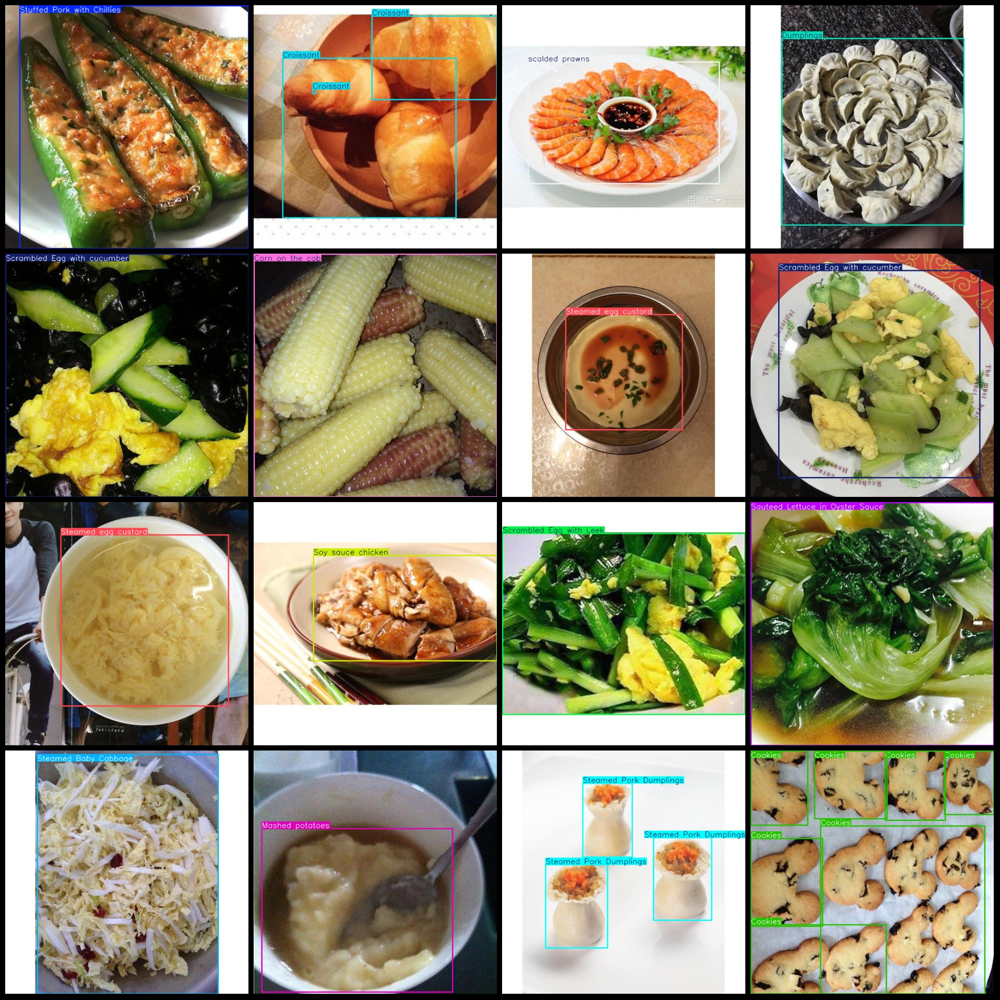
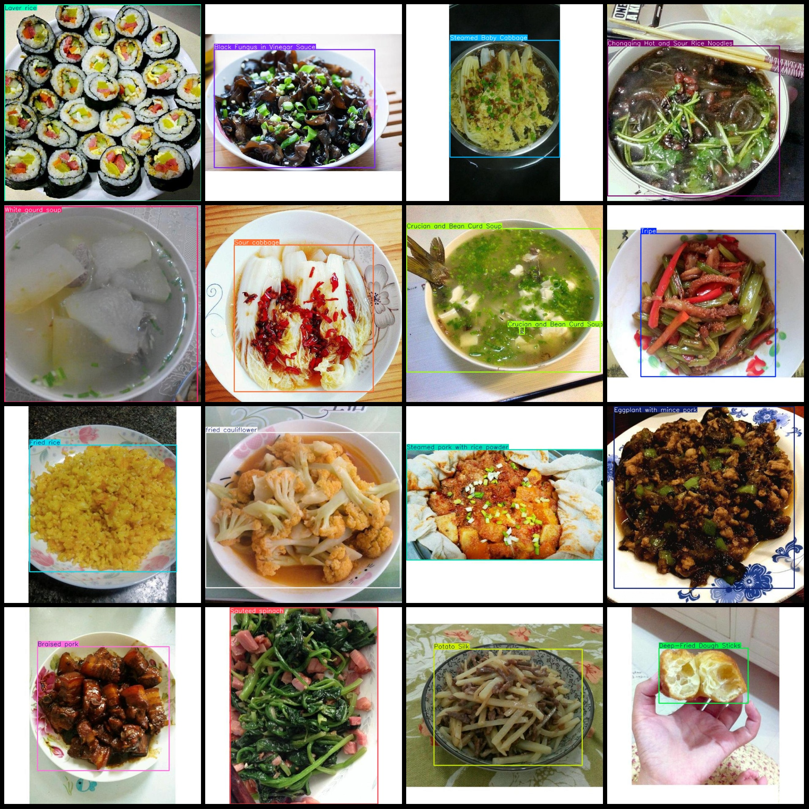

# Chinese Food Detection Dataset with VOC+YOLO Format and 6928 Images in 238 Categories

- Abalone (Abalone)
- Beef Stew with Roots
- Boiled Shredded pork in chili bean sauce
- Beef Pork Tang
- Beef steak in sweet and sour sauce
- Black Fungus (Auricularia auricula-judae)
- Braised Pork with Vermicelli
- Beef Lungs in Chili Sauce
- Beef liver
- Beef rib soup with radish
- Beef tripe
- Beef with salted vegetables
Beef wonton is a type of Chinese cuisine that consists of thin, hand-made dumplings filled with a rich mixture of minced beef and other seasonings. These dumplings are typically served in soup or as an appetizer. They are known for their tender texture and flavorful filling.
- Bibs
- Bread
- Bun Stuffed with Beef
- Buns
- Burrito
Butterfly pea
- Cabbage salad (cold lettuce salad)
- Chicken in Sweet and Sour Sauce
- Chicken liver
- Chicken with mushrooms
Chicken Wings (Famously known as Chicken Wings)
Chili crab is a dish that involves cooking crab meat in a spicy sauce. The sauce typically includes chili peppers, soy sauce, garlic, and other seasonings to create a flavorful and aromatic dish. Chili crab can be served with rice or as a side dish.
-Chicken with chilli sauce
- Chili pork
- Chinese cabbage (Chinese mustard greens)
- Cilantro
- Coffee beans
- Corn on the cob
- Crispy rice noodles
- Dumplings stuffed with pork and minced garlic (dumplings)
Eggplant, Potato, Green Pepper (Di San Xian)
- Food
- Fried cauliflower
- Fried leek dumpling
- Fried rice noodles
- Grilled fish
- Ice cream
- Intestine
- Istria (Italian pasta)
Jackfruit
- Jamón
- Jiaozi
- Jumbo pork bun
- Kaki is the Japanese name for the Chinese dish "mung bean sprouts" or "mung bean shoots."
- Lamb chops
- Lentil soup
- Loofah cake
Lotus root porridge (Porridge made from lotus seeds)
- Mandarin fish (Sweet and sour fish)
Mushroom
- Nutmeg
- Omelette
- Onion
- Papaya salad
- Peanuts
- Pepper with tiger skin (Tiger pepper)
- Pork belly with chili (Guanpi Pao)
- Pork loin
Pork sausage
- Pork trotters
- Pork with salted vegetables (Mei Cai Kou Rou)
- Pork wonton
- Potato Silk (finely sliced potato)
- Preserved egg salad (Cold Egg Salad)
- Quail's eggs
- Rice noodles
Roast goose is a traditional dish in China. It is made by roasting a whole goose with various spices, such as star anise, cinnamon, and cloves. The meat from the goose is then served with vegetables or rice. Roast goose is usually accompanied by soup or a salad.
Russian red cabbage is also known as Russian kale or Russian mustard greens. It is a leafy vegetable that is commonly used in Russian cuisine.
- Saute Spicy Chicken
- Stir-fried green peppers (Stir-fried Green Peppers)
- Stir fried Chinese greens with mushrooms
- Braised beef ribs with green peppers
- Stewed pork ribs with garlic
- Stir-fry shredded pork in sweet bean sauce (Beijing sauce pork)
- Shrimp meat (shrimp meat)
- Sauteed sliced pork with Scallion
- Sauteed pork slices with black fungus
- Braised Pork with Bean Sauce
- Braised Pork with Vermicelli
- Shrimp dumplings
- Shrimp with garlic and vermicelli spring roll
- Shrimp with Vinegar and Ginger (Shrimp with Vinegar and Ginger)
- Shrimp with water chestnut (Water Bean Cured Shrimp)
- Shrimp with vermicelli in a spicy broth
- Shrimp with vermicelli and chili bean sauce
- Shrimp with vermicelli and tomato sauce
- Shrimp with vermicelli and wasabi sauce (Wasabi shrimp)
- Shrimp with vermicelli and sesame sauce
- Shrimp with vermicelli and sweet bean sauce
- Shrimp with vermicelli and soy sauce (Soy Sauce Shrimp)
- Shrimp with vermicelli and sweet chili sauce
- Shrimp with vermicelli and vinegar
- Shrimp with vermicelli and wasabi sauce (Wasabi shrimp)
- Shrimp with vermicelli and sesame sauce
- Shrimp with vermicelli and sweet bean sauce
- Shrimp with vermicelli and soy sauce (Soy Sauce Shrimp)
- Shrimp with vermicelli and sweet chili sauce
- Shrimp with vermicelli and vinegar
- Shrimp with vermicelli and wasabi sauce (wasabi shrimp)
- Shrimp with vermicelli and sesame sauce
- Shrimp with vermicelli and sweet bean sauce
- Shrimp with vermicelli and soy sauce (Soy Sauce Shrimp)
- Shrimp with vermicelli and sweet chili sauce
- Shrimp with vermicelli and vinegar
- Shrimp with vermicelli and wasabi sauce
- Shrimp with vermicelli and sesame sauce
- Shrimp with vermicelli and sweet bean sauce
- Shrimp with vermicelli and soy sauce (Shrimp with vermicelli and soy sauce)
- Shrimp with vermicelli and sweet chili sauce
- Shrimp with vermicelli and vinegar (Vinca cumana)
- Shrimp with vermicelli and wasabi sauce (Wasabi shrimp)
- Shrimp with vermicelli and sesame sauce
- Shrimp with vermicelli and sweet bean sauce
- Shrimp with vermicelli and soy sauce (Soy Sauce Shrimp)
- Shrimp with vermicelli and sweet chili sauce
- Shrimp with vermicelli and vinegar
- Shrimp with vermicelli and wasabi sauce (Wasabi shrimp)
- Shrimp with vermicelli and sesame sauce
- Shrimp with vermicelli and sweet bean sauce (sweet bean shrimp)
- Shrimp with vermicelli and soy sauce (soy sauce shrimp)
- Shrimp with vermicelli and sweet chili sauce (sweet chili shrimp)
- Shrimp with vermicelli and vinegar (Shrimp with Vermicelli and Vinegar)
- Shrimp with vermicelli and wasabi sauce (Wasabi shrimp)
- Shrimp with vermicelli and sesame sauce (Sesame shrimp)
- Shrimp with vermicelli and sweet bean sauce (sweet bean shrimp)
- Shrimp with vermicelli and soy sauce (Shrimp with vermicelli and soy sauce)
- Shrimp with vermicelli and sweet chili sauce (sweet and spicy shrimp with vermicelli)
- Shrimp with vermicelli and vinegar (Shrimp with Vermicelli and Vinegar) Ingredients: Shrimp, pork strips, green onion, ginger, garlic, chili pepper, salt, sugar, soy sauce, cooking wine, cornstarch, sesame oil, pepper powder, chicken essence.
## Images

Here is a pay link on Stripe ( https://buy.stripe.com/3cs8yP7sY87d0vu9AB ). Please contact me lonlonago@foxmail.com after funding $89, and I will send you a complete data files , thank you!

